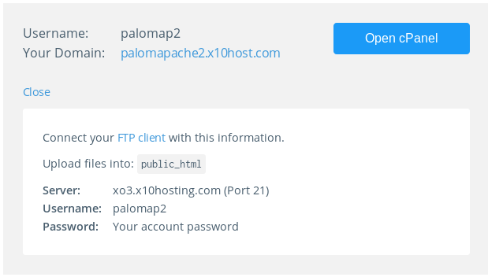
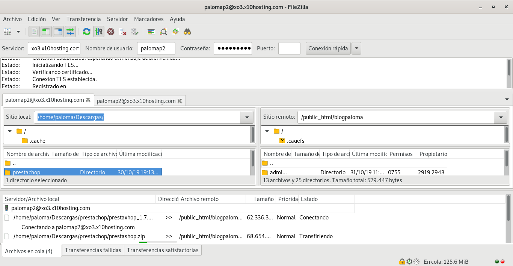
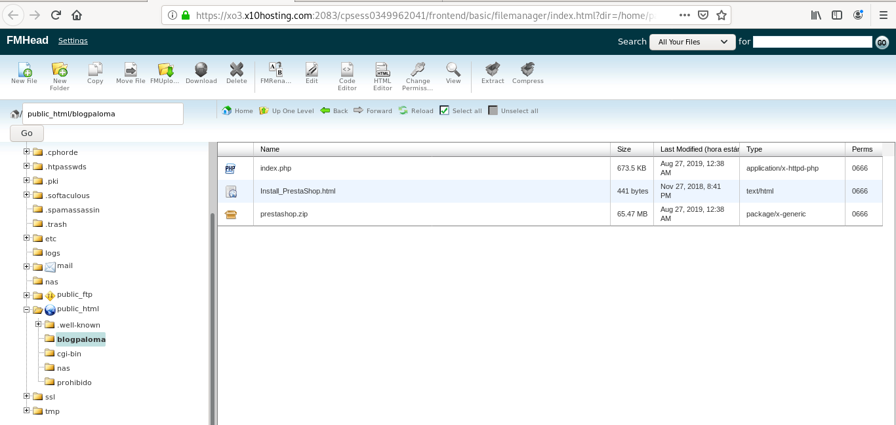
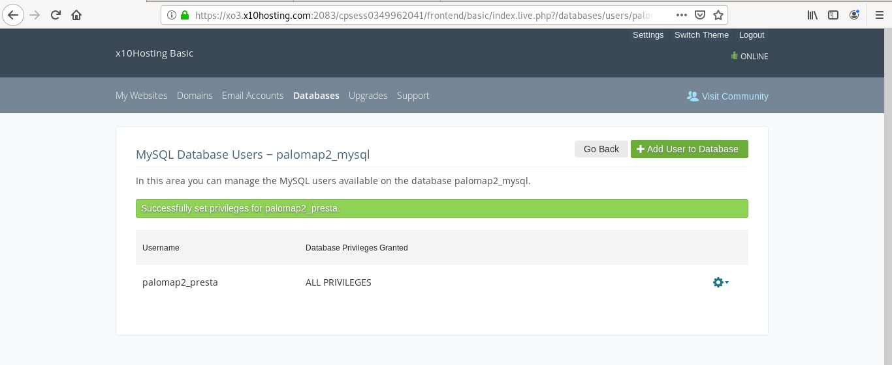
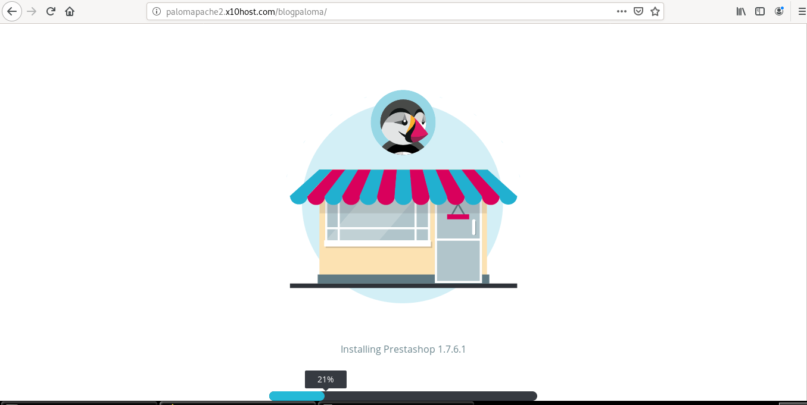
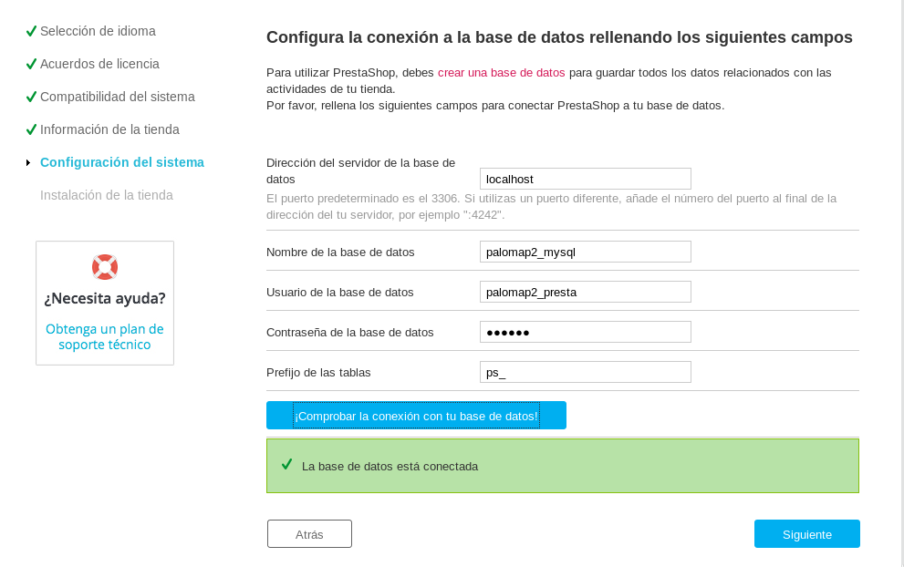
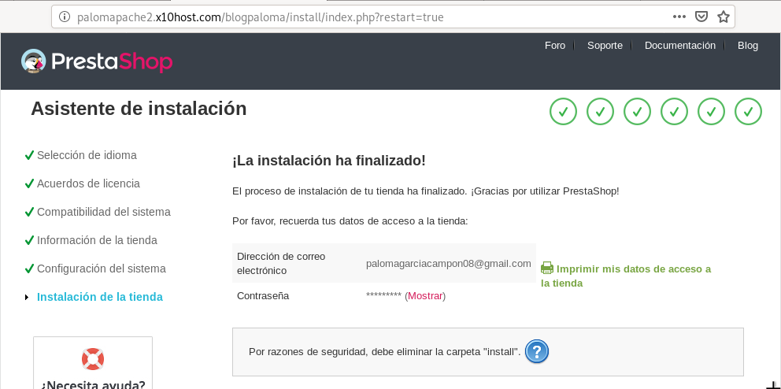
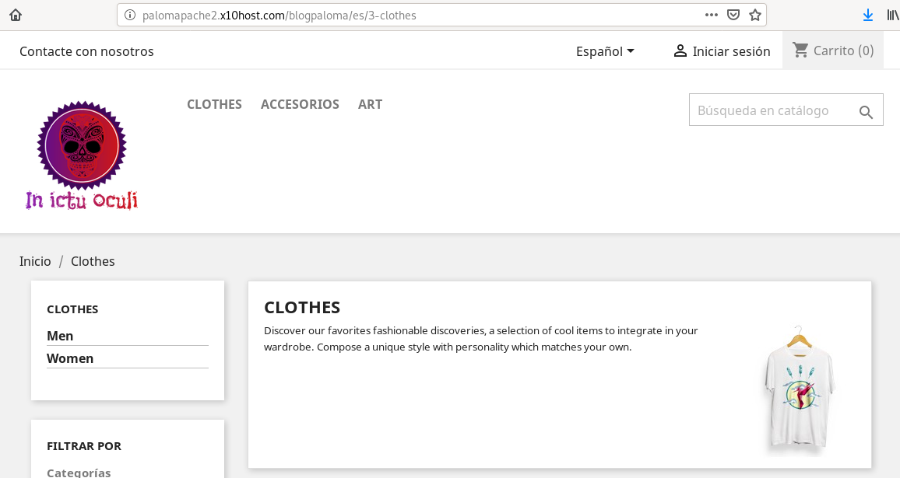
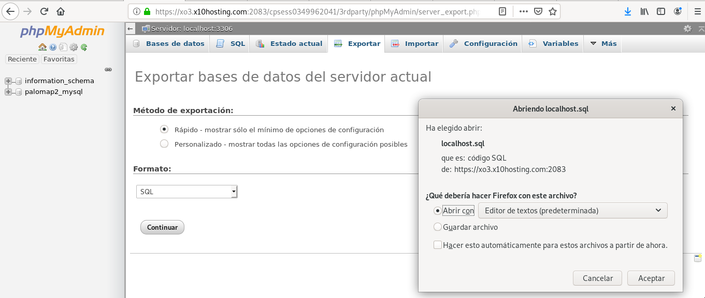
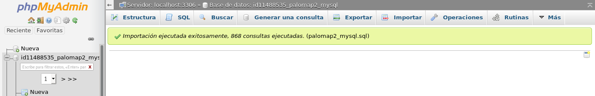

# Despliegue tradicional de CMS PHP

> Tienes dos opciones para realizar esta práctica:
1. Consideramos que el primer hosting compartido es tu servidor dedicado, posteriormente tendrás que hacer la migración a un hosting externo.
2. Utilizar dos servicios de hosting distintos (tal cómo se explica en la práctica.)

**Tarea 1: Elección del escenario que vas a montar**

Indica que opción has elegido:
- Dos servicios de hosting distintos

> Esta tarea consiste en instalar un CMS de tecnología PHP (elige un CMS que no hayas usado en la práctica anterior) en un hosting compartido. Los pasos que tendrás que dar los siguientes:

**Tarea 2: Elección de un hosting compartido**
- Elige un servicio de hosting compartido con las caracterísitcas necesarias para instalar un CMS PHP (soporte PHP, base de datos,…)
- Date de alta en el servicio.

> Indica que servicio de hosting has elegido. Indica las características del hosting que vas a utilizar. Indica la URL que tendrá tu página web. Indica el CMS que vas a instalar.

El hosting que voy a utilizar es x10hosting. Entramos en su página web y cramos un usuario. El dominio será: palomapache2.x10host.com

El segundo hosting será InfinityFree. Tras registrarnos y validar el usuario a través de un correo que nos llegará a la dirección que indiquemos. La URL será paloma-prestashop.com

**Tarea 3: Instalación del CMS PHP en el hosting compartido**
- Descarga en tu ordenado el CMS PHP que vas a instalar.
- Sube los ficheros al hosting compartido por FTP.
- Realizar la configuración de la base de datos de forma adecuada.
- Realiza la instalación.
- Realiza una configuración mínima de la aplicación (Cambia la plantilla, crea algún contenido, …)
- Instala un módulo para añadir alguna funcionalidad al CMS PHP.

> En este momento, muestra al profesor la aplicación funcionando. Entrega un documentación resumida donde expliques los pasos fundamentales para realizar esta tarea.

Se descarga el CMS en la máquina y se pasa al hosting que se va a usar en primer lugar, x10hosting, por FTP. Para ello necesitamos la siguietne información que nos aporta el hosting:

El fichero zip se descomprime y se utiliza Filezilla para pasar los ficheros que se han descomprimido:
(Imagen de Filezilla)

El resultado es el siguiente:

En la pestaña Databases del hosting se crea la base de datos y el usuario, palomap2_presta, al que se le otorgan todos los privilegios.

Accediendo al dominio que nos proporciona el hosting, http://palomapache2.x10host.com/blogpaloma/, se comienza la instalación del CMS.

Durante la isntalación del nuevo CMS se introducen los datos de la base de datos que se ha creado anteriormente. 

Una vez acabada la isntalación, se informa de que es recomendable eliminar la carpeta "install" por seguridad.

Como administrador se modifica la apariencia del sitio web. El tema, se añaden módulos, el logo, etc.

**Tarea 4: Migración de la apliación web**
- Elige otro servicio de hosting para PHP.
- Realiza el proceso de migración.

> Entrega una documentación resumida donde expliques los pasos fundamentales para realizar esta tarea. En este momento, muestra al profesor la aplicación funcionando en el otro hosting.

En el primer hosting hay que haccer una copia de seguridad de la base de datos y del CMS. Para hacer la copia de seguridad de la base de datos en x10hosting se accede a la pestaña donde se guardan las bases de datos que tenemos y se selecciona la opción phpMyAdmin. En este sitio está la pestaña exportar, que la usamos con las opciones rápido, como métido de exportación, y SQL como formato. 

A continuación, se realiza la copia del CMS. Para ello se copian todos los directorios y ficheros de nuestro CMS a nuestro equipo por FTP.

Para realizar la copia de la base de datos en el nuevo hosting, InfinityFree, con la herramienta phpMyAdmin se importa la base de datos que se ha descargado del anterior hosting.

-----------------------------------------------------

NOTA: El script que nos descargamos de x10hosting indica que el usuario de la base de datos es el usuario del hosting anterior. Se ha intentado crear un nuevo usuario de base de datos en el nuevo hosting con el nombre del anterior propietario. El problema es que algunos de los caracteres del usuario antiguo no están permitidos en el nuevo hosting. Para ello, lo que se ha modificado es el propio script .sql de la siguiente forma:

Antes:
~~~
-- Base de datos: `palomap2_presta`
--
CREATE DATABASE IF NOT EXISTS `palomamysql` DEFAULT CHARACTER SET latin1 COLLATE latin1_swedish_ci;
USE `palomamysql`;
~~~
Después:
~~~
-- Base de datos: `mypalomap`
--
CREATE DATABASE IF NOT EXISTS `palomamysql` DEFAULT CHARACTER SET latin1 COLLATE latin1_swedish_ci;
USE `palomamysql`;
~~~

**Tarea 5: Copia de seguridad de tu aplicación**
- ¿Cómo harías una copia de seguridad de tu aplicación? ¿Crees que se puede automatizar dicha tarea?

> Entrega una documentación donde indiques los pasos para realizar una copia de seguridad. Si puedes realiza un pequeño script que automatice dicha tarea.

